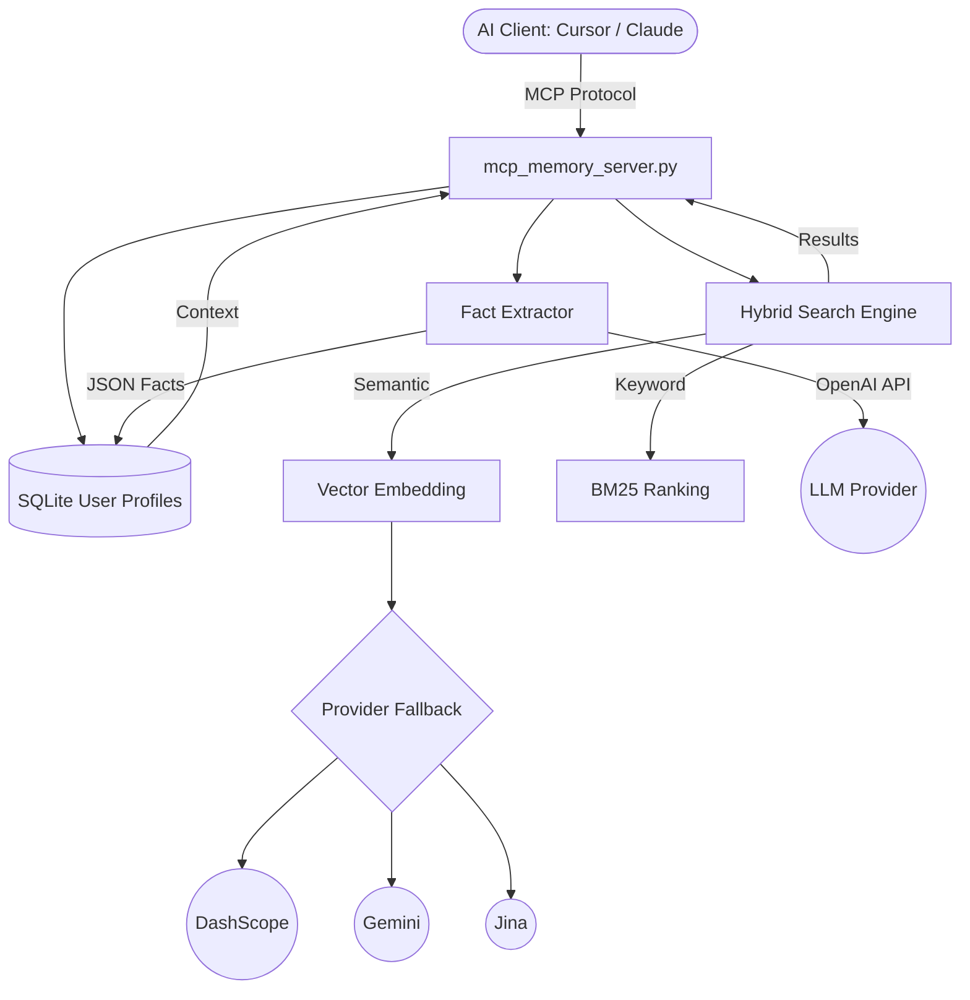

# 🧠 OpenClaw Memory V4 — Local Supermemory Engine

> **Privacy-first AI memory**: Hybrid vector search + SQLite user profiles + autonomous fact extraction.
> Works as a standalone MCP plugin for **Cursor**, **Claude Desktop**, **Windsurf**, and any MCP-compatible client.

[](LICENSE)

## ✨ Features

| Feature | Description |
|---------|-------------|
| **Hybrid Search** | Vector embedding (70%) + BM25 keyword (30%) with Cross-Encoder reranking |
| **User Profiles** | Structured `STATIC` traits & `DYNAMIC` context with auto-expiring TTL |
| **Fact Extraction** | LLM-powered autonomous extraction of user facts from conversations |
| **Multi-Provider** | DashScope → Google Gemini → Jina AI automatic fallback |
| **MCP Plugin** | Standard protocol — plug into any AI tool, no vendor lock-in |
| **Local-First** | All data stays on your machine (SQLite + JSON). Zero cloud dependency |

## 🚀 Quick Start

### Option 1: MCP Plugin (Recommended)

Add to your `claude_desktop_config.json` or Cursor MCP settings:

```json
{
  "mcpServers": {
    "local-memory": {
      "command": "python3",
      "args": ["<path-to>/mcp_memory_server.py"],
      "env": {
        "MEMORY_STORAGE_PATH": "<path-to>/memory_v4.json",
        "PROFILES_DB_PATH": "<path-to>/profiles.sqlite",
        "LLM_API_KEY": "your-api-key-here",
        "LLM_BASE_URL": "https://dashscope.aliyuncs.com/compatible-mode/v1",
        "LLM_MODEL": "qwen-plus"
      }
    }
  }
}
```

### Option 2: Python Library

```python
from user_profile_manager import UserProfileManager
from fact_extractor import FactExtractor

profiles = UserProfileManager("./profiles.sqlite")
profiles.add_fact("alice", "Senior Python developer", "STATIC")
profiles.add_fact("alice", "Busy with project launch", "DYNAMIC", ttl_days=7)

print(profiles.get_context_string("alice"))
```

## 🔌 MCP Tools Reference

| Tool | Description |
|------|-------------|
| `search_memory` | Hybrid semantic + keyword search with profile context |
| `add_memory` | Store new information for future retrieval |
| `get_user_profile` | Retrieve structured user traits and current context |
| `add_user_fact` | Manually add a STATIC or DYNAMIC fact |
| `delete_user_fact` | Remove a fact by ID |
| `list_users` | List all users with fact counts |
| `extract_facts` | LLM-powered autonomous fact extraction from conversation |

## ⚙️ Environment Variables

| Variable | Required | Default | Description |
|----------|----------|---------|-------------|
| `MEMORY_STORAGE_PATH` | No | `./memory_v4.json` | Path to JSON memory file |
| `PROFILES_DB_PATH` | No | `./profiles.sqlite` | Path to SQLite profiles database |
| `LLM_API_KEY` | For `extract_facts` | — | API key for any OpenAI-compatible endpoint |
| `LLM_BASE_URL` | No | DashScope | LLM API base URL |
| `LLM_MODEL` | No | `qwen-plus` | Model name for fact extraction |
| `LOG_LEVEL` | No | `INFO` | Logging verbosity (DEBUG/INFO/WARNING) |

## 🏗️ Architecture



## 🔄 Comparison with Alternatives

| Capability | mem9 | Supermemory | **OpenClaw V4** |
|:---|:---:|:---:|:---:|
| **Local-first** | ❌ Cloud | ❌ Cloud | ✅ **SQLite + JSON** |
| **Structured Profiles** | ❌ | ✅ | ✅ **STATIC + DYNAMIC** |
| **Auto TTL** | ❌ | ✅ | ✅ **Self-expiring** |
| **Hybrid Search** | ✅ | ✅ | ✅ **Vector + BM25 + Rerank** |
| **MCP Standard** | ❌ | ❌ | ✅ **Universal plugin** |
| **Open Source** | ✅ | Partial | ✅ **MIT License** |

> [!TIP]
> OpenClaw Memory V4 is designed as the **"Local Ground Truth"** for your AI agents. It doesn't just store data — it understands **who** the user is.

## 📜 License

MIT

---

*Developed with ❤️ by [sunhonghua](https://github.com/sunhonghua1) | Powered by Foxbot Engine*
