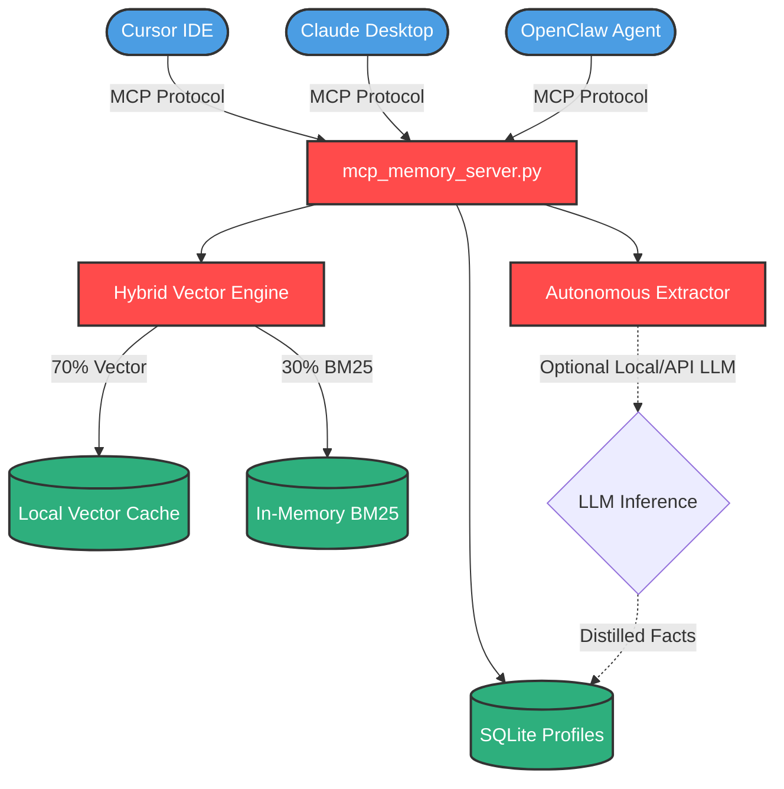

<div align="center">
  
  <h1>🧠 支持“龙虾”(OpenClaw)与其他模型的 MCP 记忆插件</h1>
  <p><strong>Universal MCP Memory Plugin for OpenClaw & AI Models</strong></p>

  [](LICENSE)
  [](https://modelcontextprotocol.io/)
  []()
</div>

> **一次配置，全模型通用。** 
> 这是一个完全本地化、支持 **Model Context Protocol (MCP)** 的记忆增强核心。专门为 OpenClaw（龙虾框架）、Claude Desktop、Cursor 以及任何大模型提供持久化的记忆库。融合了 OpenClaw V3 的语义精准度、mem9 的持久化沙盒架构，以及 Supermemory 的自主画像提炼能力。

---

## 🌟 Why OpenClaw Memory V4?

Most AI memory solutions force you to choose between vendor lock-in, expensive cloud APIs, or dumb keyword search. **V4 changes the game:**

*   **🔌 Universal MCP Support**: Use your local memory not just in OpenClaw, but in **Cursor**, **Claude Desktop**, **Windsurf**, or any MCP-compatible client. Your memory follows *you*, not the framework.
*   **🛡️ 100% Local (Zero Cloud API)**: Your data stays on your hard drive (SQLite + JSON). No data is sent to third-party memory servers. It's your personal, private vault.
*   **🧠 "Supermemory" Profiling**: Automatically extracts `STATIC` traits (e.g., "User is a Python dev") and `DYNAMIC` states (e.g., "Busy this week") with self-expiring TTLs.
*   **🎯 Hybrid Search V4.5**: True Vector Semantic Search (70%) + BM25 Keyword Search (30%) + Cross-Encoder Reranking. Finds exactly what you mean, not just what you said.

---

## ⚔️ The Ultimate Feature Fusion

| Feature | `mem9` | `Supermemory` | **OpenClaw V4** |
|:---|:---:|:---:|:---:|
| **Zero Cloud API (Local SQLite)**| ❌ | ❌ | ✅ **Yes** |
| **Universal MCP Plugin** | ❌ | ❌ | ✅ **Yes** |
| **Auto-Expiring Context (TTL)**| ❌ | ✅ | ✅ **Yes** |
| **Structured User Profiling** | ❌ | ✅ | ✅ **STATIC & DYNAMIC** |
| **Hybrid Search (Vector+BM25)**| ✅ | ✅ | ✅ **Self-Hosted** |
| **Open Source** | ✅ | Partial | ✅ **MIT License** |

---

## 🚀 Quick Start (MCP Plugin)

Turn your local machine into a persistent brain for any AI assistant in under 1 minute.

### 1. Installation

```bash
git clone https://github.com/sunhonghua1/openclaw-memory-v3.git
cd openclaw-memory-v3
pip install -e .
```

### 2. Connect to Claude Desktop / Cursor

Open your MCP config file (e.g., `claude_desktop_config.json`) and add:

```json
{
  "mcpServers": {
    "local-supermemory": {
      "command": "python3",
      "args": ["<path-to-repo>/mcp_memory_server.py"],
      "env": {
        "MEMORY_STORAGE_PATH": "./memory_v4.json",
        "PROFILES_DB_PATH": "./profiles.sqlite"
        // Optional: Add local LLM API for Auto-Fact Extraction
        // "LLM_API_KEY": "your-key",
        // "LLM_BASE_URL": "http://localhost:11434/v1" 
      }
    }
  }
}
```

---

## 🛠️ MCP Tools Reference

Once connected, your AI assistant gains access to these powerful native capabilities:

| 🔧 Tool Name | 📝 Description |
|---|---|
| `search_memory` | Hybrid search combining semantic meaning, exact keywords, and your active user profile. |
| `get_user_profile` | Injects your permanent traits and current context into the LLM prompt. |
| `add_user_fact` | Teach the AI a `STATIC` (permanent) or `DYNAMIC` (temporary) fact about you. |
| `extract_facts` | *(Requires LLM)* The AI autonomously reads the chat and distills new facts into SQLite. |
| `list_users` | View all user profiles and their active fact counts. |

---

## 🏗️ Architecture Visualization



---

<div align="center">
  <i>Engineered for Data Sovereignty by <a href="https://github.com/sunhonghua1">sunhonghua</a></i><br>
  <i>Powered by the <b>Foxbot Engine</b> & <b>OpenClaw Community</b></i>
</div>
