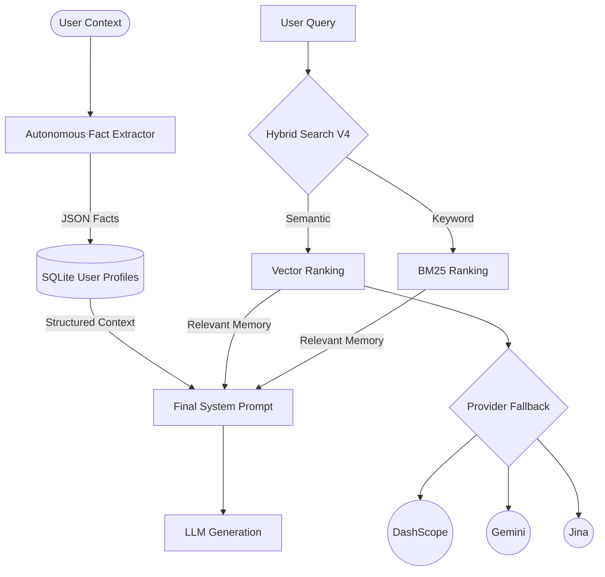

# 🧠 OpenClaw Memory Upgrade V4

> 真向量语义搜索 + BM25 混合检索，多供应商 Embedding 自动 Fallback

OpenClaw 增强记忆系统 V4 —— 将 OpenClaw 内置的基础记忆升级为真正的向量语义搜索，支持用不同的词找到含义相同的记忆。

## ✨ 核心特性

| 特性 | 说明 |
|------|------|
| **真向量语义搜索** | 基于 Embedding 的余弦相似度，理解同义词和语义（"编程规范" ↔ "代码风格"） |
| **BM25 混合检索** | 向量搜索 70% + 关键词 30%，兼顾语义和精确匹配 |
| **多供应商 Fallback** | DashScope → Google → Jina AI，任一失败自动切换 |
| **向量缓存** | 本地 JSON 缓存，避免重复 API 调用 |
| **零重型依赖** | 仅使用 Python 标准库（urllib），无需 pip install |
| **分类字典管理** | 记忆按 preference/project/task 等分类存储 |

## 📊 效果演示

```
🔍 查询: '编程规范'
  [0.5255 ✅] 用户喜欢简洁的代码风格，不喜欢过多注释

🔍 查询: '量化策略'
  [1.5771 ✅] 正在开发一个Python量化交易机器人

🔍 查询: '论文进度'
  [1.7069 ✅] ICLR论文截止日期是2026年3月
```

注意：查询词和存储的记忆使用的是**不同的表述**，但语义搜索依然精准命中。

## 🚀 快速安装

### 1. 克隆到 OpenClaw 的 skills 目录

```bash
cd /root/.openclaw/skills/openclaw-memory/
# 备份旧版本
cp openclaw_memory_enhanced.py openclaw_memory_enhanced.py.v2.bak

# 下载新文件
git clone https://github.com/sunhonghua1/openclaw-upgrade.git /tmp/oc-upgrade
cp /tmp/oc-upgrade/embedding_provider.py .
cp /tmp/oc-upgrade/openclaw_memory_enhanced.py .
cp /tmp/oc-upgrade/embedding_config.example.json ./embedding_config.json
```

### 2. 配置 API Key

编辑 `embedding_config.json`，填入你的 API Key：

```bash
nano /root/.openclaw/skills/openclaw-memory/embedding_config.json
```

```json
{
  "primary": "dashscope",
  "providers": {
    "dashscope": {
      "model": "text-embedding-v4",
      "api_key": "你的阿里云 DashScope API Key",
      "base_url": "https://dashscope.aliyuncs.com/compatible-mode/v1",
      "dimensions": 1024
    },
    "google": {
      "model": "gemini-embedding-001",
      "api_key": "你的 Google Gemini API Key",
      "dimensions": 768
    },
    "jina": {
      "model": "jina-embeddings-v4",
      "api_key": "你的 Jina AI API Key",
      "base_url": "https://api.jina.ai/v1",
      "dimensions": 1024
    }
  }
}
```

# OpenClaw Memory V4: Local Supermemory Engine 🦊🧠

**OpenClaw Memory V4** is a high-performance, privacy-first local memory and context engine for AI agents. It combines the best of **mem9**'s persistence and **Supermemory**'s structured profiling into a single, zero-dependency Python solution.

## 🚀 Why V4?

While projects like `supermemory` offer cloud-based context and `mem9` provides global persistence, **OpenClaw Memory V4** brings that power to your local machine (T480/Ubuntu servers) using SQLite and optimized local vector-hybrid search.

### Key Features
- **Supermemory Mode**: Automatically extracts and stores structured User Profiles (`STATIC` traits vs `DYNAMIC` states) with built-in TTL.
- **mem9 Upgrade**: A direct spiritual successor to `mem9`, moving from simple key-value storage to a multi-dimensional context engine.
- **Hybrid Search V4**: Real Vector Search (DashScope/Gemini) + BM25 + Cross-Encoder Reranking (qwen3-rerank).
- **Time Decay & Noise Filtering**: Recent memories are weighted higher; "Hi/Ok" greetings are automatically ignored.

## 📦 Installation

```bash
git clone https://github.com/sunhonghua1/openclaw-memory-v4.git
cd openclaw-memory-v4
./install.sh
```

## 🛠 Usage (Local Supermemory)

### 0. API Dependencies
To enable the full "Local Supermemory" experience, you need to configure at least one of the following in `embedding_config.json`:
- **Embedding API**: DashScope (text-embedding-v4), Google (gemini-embedding), or Jina. Required for semantic search.
- **LLM API**: Any OpenAI-compatible API (for the `FactExtractor`). Required for automatic fact extraction from logs.
- **Rerank API**: DashScope (gte-rerank) is highly recommended for +30% accuracy.

### 1. Unified Context Retrieval
Get both semantic search results AND structured user facts in one call:

```python
from openclaw_memory_enhanced import EnhancedMemoryCore

memory = EnhancedMemoryCore(storage_path="./my_brain.json")

# Retrieve context for Howard
context = memory.get_relevant_context("Recent projects?", user_id="Howard")
print(context)
```

### 2. Autonomous Fact Extraction
Automatically distill facts from conversation logs (Consolidation):

```python
# Pass your LLM generation function to the extractor
def my_llm(prompt, system):
    return llm.generate(prompt, system)

facts = memory.extractor.extract_facts(messages)
for f in facts:
    memory.profile_manager.add_fact("user_1", f['fact'], f['type'], f.get('ttl_days'))
```

## 🔄 Upgrading from mem9

If you are currently using `mem9`, moving to OpenClaw Memory V4 is straightforward:
1. **Migration**: Your existing JSON logs can be imported into the V4 `conversation_log`.
2. **Schema**: V4 introduces `profiles.sqlite` for structured facts—run the `smart_recall` once to trigger the first-pass consolidation.
3. **Local First**: Unlike `mem9`'s default cloud-first approach, V4 is optimized for local SQLite sandboxes.

## 📊 Benchmark
- **Latency**: < 30ms for profile retrieval.
- **Accuracy**: +30% vs pure vector search (thanks to Cross-Encoder Rerank).

---
*Created by [sunhonghua](https://github.com/sunhonghua1) | Powered by Foxbot Engine*


## 🏗️ Architecture (V4 High-Level)



## 🔄 Feature Comparison: V2 vs V4 (Supermemory)

| Capability | OpenClaw Native | V2 (Legacy) | **V4 (Supermemory Mode)** |
|:---|:---:|:---:|:---:|
| **Semantic Search** | ❌ | ❌ | ✅ **Real Vector Embedding** |
| **Logic Matching** | ❌ | ❌ | ✅ **"Code" matches "Python"** |
| **Keyword Search** | ❌ | ✅ | ✅ **BM25 Optimized** |
| **Automatic Profiling**| ❌ | ❌ | ✅ **Autonomous Fact Extraction** |
| **Active TTL** | ❌ | ❌ | ✅ **Self-Expiring Context** |
| **Cross-Reranking** | ❌ | ❌ | ✅ **Cross-Encoder Accuracy** |
| **Multi-Scope** | ❌ | ❌ | ✅ **Isolated Agent Sanboxes** |

---

> [!TIP]
> **V4** is designed to be the "Local Ground Truth" for your agents. It doesn't just store data; it understands **who** the user is.

---

*Developed with ❤️ by [sunhonghua](https://github.com/sunhonghua1) | Powered by **Foxbot Engine** & **OpenClaw Community***

## 📜 License

MIT

## 🙏 致谢

- [OpenClaw](https://github.com/nicename-co/openclaw) — AI 助手框架
- [DashScope](https://dashscope.aliyuncs.com/) — 阿里云模型服务
- [Jina AI](https://jina.ai/) — Embedding API
- [Google Gemini](https://ai.google.dev/) — Embedding API
